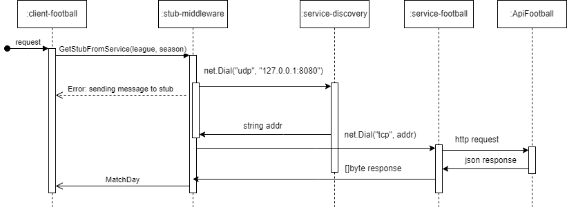

# Socket-based middleware for distributed applications

This repository contains the implementation of a socket-based middleware for communication between clients and servers in distributed applications. The project focuses on abstracting socket handling from the client through a stub controlled by the middleware.
The chosen case study is a service that retrieves the current round of a football championship, demonstrating the middleware's applicability in a real-world scenario.

## Technologies

1. **Golang (Go)**: Chosen for its suitability for distributed systems and the team's familiarity with the language.
2. **Api-Football**: External API used to fetch football match data.

## Components



The sequence diagram likely shows how these components interact with each other to fulfill a request for current round data in a football championship.

- **stub-middleware**: Abstracts socket implementation and provides a controlled interface for clients.
- **client-football**: Requests current round data from the stub.
- **service-football**: Communicates with ApiFootball to retrieve match data.
- **service-discovery**: Stores service names, IPs, and ports.

## How to Run

1. Ensure you have Golang version 1.22.2 or later installed.
2. Clone the repository:

```bash
git clone https://github.com/franklaercio/middleware-football.git
cd middleware-football
```

3. Start the services:

```bash
cd service-football && go run main.go
cd service-discovery && go run main.go
```

4. Run the client:

```bash
cd client-football && go run main.go
```

## Benefits of Using Middleware

- Simplified Client Development: Clients interact with a straightforward interface instead of complex socket programming.
- Scalability: Easier to add new services and clients without modifying existing code.
- Flexibility: Middleware can handle various communication protocols and data formats.

## Contributors

- Frank Laércio
  - GitHub: [franklaercio](https://github.com/franklaercio)
  - LinkedIn: [Frank Laércio](https://www.linkedin.com/in/frank-laercio/)
- Ohanna Dezidério
  - GitHub: [ohannadeziderio](https://github.com/ohannadeziderio)
  - LinkedIn: [Ohanna Dezidério](https://www.linkedin.com/in/ohanna-d-85a787a5/)

## Conclusion

Implementing a socket-based middleware offers significant advantages for building scalable and maintainable distributed applications. This project demonstrates its effectiveness through a practical case study, showcasing the benefits of abstraction and centralized communication management.
